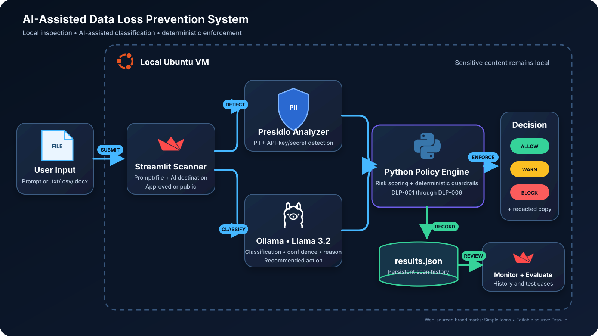

# AI-Assisted Data Loss Prevention System

- For this project, I built a local AI-assisted Data Loss Prevention (DLP) system on an Ubuntu virtual machine to inspect text prompts and supported files before sensitive information is submitted to an AI platform. The application uses Microsoft Presidio and custom pattern detection to identify personally identifiable information (PII) and exposed secrets, while a locally hosted Llama 3.2 model through Ollama classifies the business sensitivity of the content and explains the risk. A deterministic Python policy engine combines those signals with the selected AI destination to return an `ALLOW`, `WARN`, or `BLOCK` decision. I then created a Streamlit dashboard for live scanning, automatic redaction, activity monitoring, and repeatable evaluation. The main goal of this lab was to demonstrate how AI can assist a security control without allowing the model alone to make the final enforcement decision.

# System Topology

  

- The entire workflow runs locally on the Ubuntu VM. A user enters a prompt or uploads a supported `.txt`, `.csv`, or `.docx` file through the Streamlit interface and selects either an approved enterprise AI service or an unapproved public AI service as the destination. Presidio and a custom secret recognizer inspect the content for sensitive entities, and Ollama runs Llama 3.2 locally to classify the information and provide a confidence score, reason, and recommended action. The deterministic risk and policy engine makes the final `ALLOW`, `WARN`, or `BLOCK` decision, produces a sanitized version when sensitive values are found, and records the result in `results.json` for the Monitoring and Evaluation views.

# Setting Up the Ubuntu Environment

- To begin, I installed Python and the supporting package-management tools needed to build and run the local DLP application.

- I created a dedicated project directory and Python virtual environment so the lab dependencies would remain isolated from the rest of the Ubuntu system.

- Inside the virtual environment, I installed Microsoft Presidio and the supporting natural-language processing packages required for sensitive-data detection.

# Building and Testing Sensitive Data Detection

- I created a test file containing synthetic sensitive information so the scanner could be developed safely without using real personal or company data.

- I ran the first detection test and confirmed that Presidio could locate sensitive entities in the sample content. This created the rule-based detection layer used later by the complete DLP pipeline.

# Installing the Local AI Model

- Next, I installed Ollama on Ubuntu so the language model could run locally instead of sending the test content to an external cloud model.

- I downloaded the Llama 3.2 model that would classify the scanned content as `Public`, `Internal`, `Confidential`, or `Restricted`.

- After the model was available, I verified that Ollama could process a local request before connecting it to the Python scanner.

# Building the AI-Assisted DLP Pipeline

- I combined Presidio PII detection, custom API-key and secret detection, and local Llama classification into one scanning workflow. The AI returned structured classification details, while the Python policy engine remained responsible for the final enforcement decision.

- I tested the pipeline with synthetic prompts representing different sensitivity levels and AI destinations. The scanner calculated a risk score and applied deterministic policies `DLP-001` through `DLP-006` to produce an `ALLOW`, `WARN`, or `BLOCK` result.

- I confirmed that the completed local workflow returned the detected data types, classification, risk, policy reason, decision, and a redacted version of the scanned content.

# Creating the Streamlit Dashboard

- After validating the command-line workflow, I installed Streamlit to provide a clear interface for scanning, monitoring, and evaluating DLP activity.

- I launched the **Data Loss Prevention Dashboard**, which organized the application into `Scanner`, `Monitoring`, and `Evaluation` tabs.

# Testing the Scanner

- In the Scanner tab, I entered test content, selected the intended AI destination, and ran a live scan. The interface displayed the data classification, AI confidence, risk score, enforcement decision, detected data types, matched policy, assessment, and sanitized text.

# Monitoring DLP Activity

- I used the Monitoring tab to review saved scan history from `results.json`. The dashboard summarized high-risk activity, enforcement actions, data classifications, sensitive data types, and individual events for investigation.

# Evaluating the Detection Logic

- Finally, I used the Evaluation tab to run repeatable test cases and compare expected policy outcomes with the scanner's actual decisions. This helped verify that the detection and enforcement logic responded consistently across different types of content and destinations.

# Project Outcomes

- Built a local AI-assisted DLP pipeline using Python, Microsoft Presidio, Ollama, and Llama 3.2.
- Detected PII and exposed secrets in text prompts and supported `.txt`, `.csv`, and `.docx` files.
- Applied deterministic DLP policies to return `ALLOW`, `WARN`, or `BLOCK` decisions and redact sensitive values.
- Created Scanner, Monitoring, and Evaluation views in Streamlit with persistent scan history in `results.json`.
- Evaluated the system with synthetic sensitive data without sending the content to an external AI model.

Built and Documented by Aluseni Waritay
